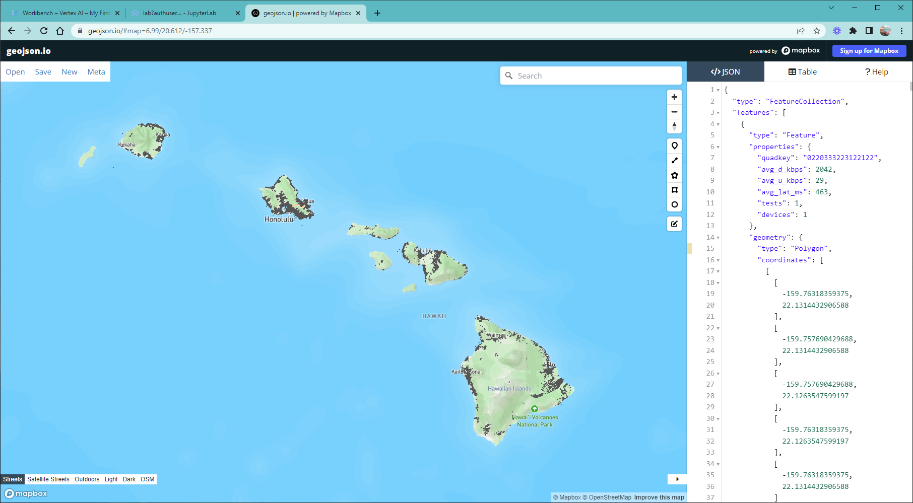

# ookla-open-data-notebook

This workbook was built by Pacific Broadband and Digital Equity (https://pacificbroadband.org) to explore ookla-open-data speeds specific to the United States Pacific territories. The beginning of the workbook in particular borrows from the tutorials at https://github.com/teamookla/ookla-open-data. Parsing out the data from millions and millions of quarterly speed reports into small slices takes significant time, especially just to read the data into a geopandas dataframe. 

Once that is done, this workbook generates an output geojson file (the format of which could easily be switched) and a data summary to text, like this:

`guam 2022Q3 Stats... Download (mean Mbps) 46.69761086956522 Upload (mean Mbps) 6.610093478260869 Latency (mean ms) 19.080434782608695 Tests 8612 Devices 2908`

Geojson can be uploaded into a variety of systems, including Mapbox:

The repo contains sample data downloaded for various locations in the Pacific. Other locations could easily be processed with the notebook. Conversion of the notebook to an operational service would be straightforward, but the geopandas file loading bottleneck would need to be considered for that work.  

Special thanks to Government of Guam and Coordinator Tyrone Taitano for their support of this work.
